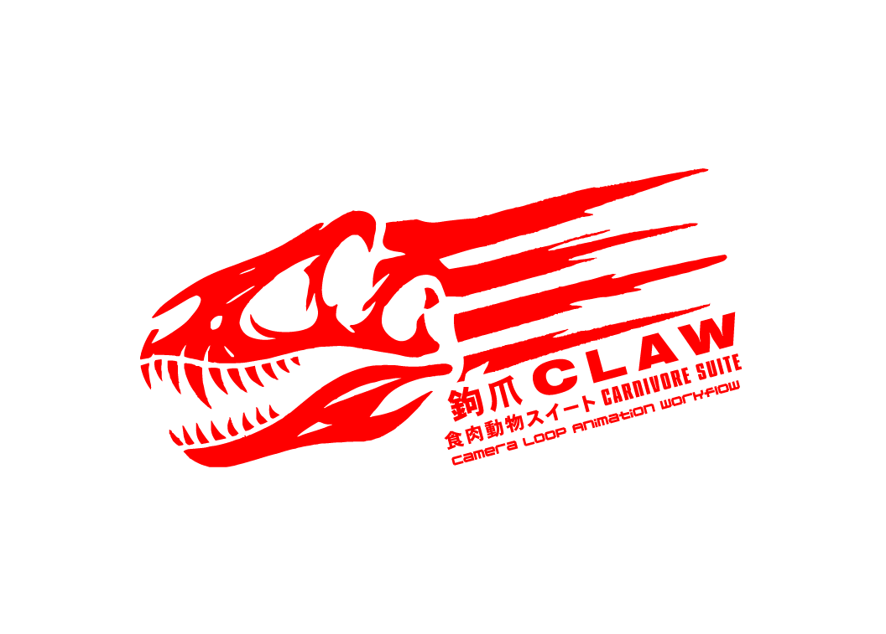
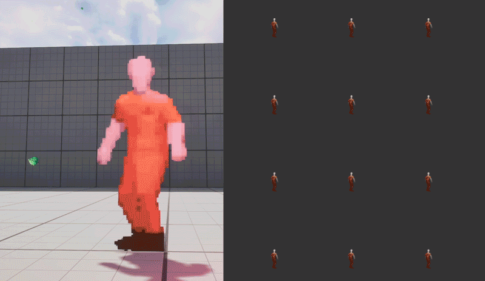
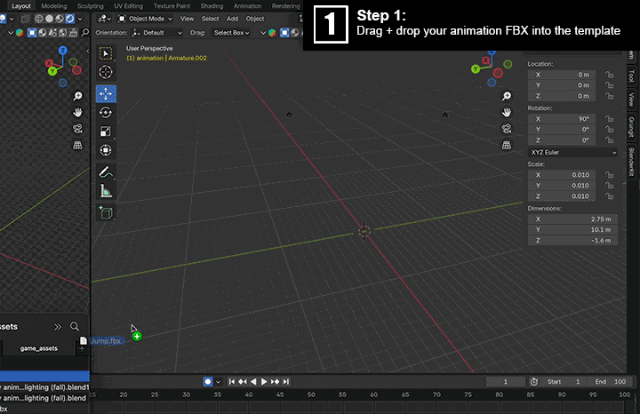
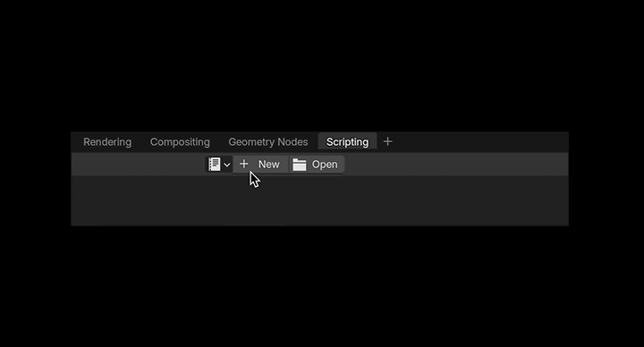

 
# CarnivoreSuite CLAW

**CarnivoreSuite CLAW** is a lightweight pipeline for creating 2D assets and sprite sheets from 3D models. It takes animations from as many cameras/directions as you designate in your scene, renders an animation for each, organizes them into folders, and uses Montage to stitch the individual frames together into a sprite sheet. This tool is game-engine agnostic, it only requires a copy of Blender to render your 3D model making it perfect for generating 2.5D, multi-directional sprite-based characters.

---

 
 <sub>Need a ton of individual sprite sheets for different angles like this rendered out for a 2.5D/2D billboarding character? Rendering those 12 frames of animation 8 different times for 8 separate sprite directions can become extremely tedious after a while if you attempt to do this manually. CLAW is also useful for automating bump map generation and other types of maps and skin variants rapidly for your 2D/3D character.</sub>

## Installation

1. Clone the repository:
    ```bash
    git clone https://github.com/bruceki/CS_Claw.git
    ```

2. Ensure you have the required dependencies installed:
    - **Blender** (with Python API enabled)
    - **ImageMagick** (Montage utility)

---

## How to Use

CLAW can easily be adapted to be used for any number of motion sources you might have kicking around somewhere. in the following example I will show you how to easily use this with Mixamo animations with the stock CS_Claw.blend file in the Blender folder.

### Importing Animations


    
Start by going into CS_Claw.blend template, and drag an .fbx file you have downloaded from Mixamo onto it.
Trim the timeline to match where you want the animation to loop/end.


### Configuration
All of your configuration will take place here:
```python
output_base_path = '/your/output/folder/here/' # Where your files will be put
montage = '/opt/homebrew/bin/montage' # Change this to be wherever montage is. use which montage if you are on *nix

image_format = 'PNG'
image_extension = '.png'
image_width = 1920
image_height = 1080

sheet_name = 'spritesheet'
sprite_geom_W = 512 # Sprite cell width
sprite_geom_H = 512 # Sprite cell height
filter = 'Catrom' # Image filter type
background = 'transparent' # background for sprite sheet

num_columns = 6 # Number of columns in your sprite sheet

camera_list = [ # Ensure these all match the camera names in your scene
    'Front_Camera', 
    'FrontRight_Camera', 
    'Right_Camera', 
    'Back_Right', 
    'Back_Camera', 
    'Back_Left', 
    'Left_Camera', 
    'FrontLeft_Camera'
]
```


1. Set up the paths for output:
   Update the script with your desired output folder:
   ```python
   output_base_path = '/your/output/folder/here/'
   ```

2. Customize the camera list and sprite sheet parameters, the default config above will assume there are 8 cameras in your scene. (make sure these match the camera names in your scene):
   ```python
   camera_list = ['Camera1', 'Camera2', 'Camera3']
   num_columns = 6  # Adjust to your preference
   ```

3. Run the script:
   Use the Blender Python API to run the script inside your Blender project. You can copy + paste the contents of CS_Claw.py in the Python folder over into your scripts panel in Blender and save it for future use.



   Just make a new script with + new, paste what you have, click the play button, and wait for it to complete. It will create the directory structure, populate each folder with frames, and use montage to combine them into a sprite sheet.
   
---


## To-Do List

- [ ] Add more customizable sprite sheet geometry options
- [ ] Integrate optional GUI for easy configuration
- [ ] Include options for bump/light map generation as well
- [ ] Explore integration with Unity and Unreal engines

---

## License

"Do whatever the fuck you want but if you make it better fork this project so I can use it too." — free beer, free software.
