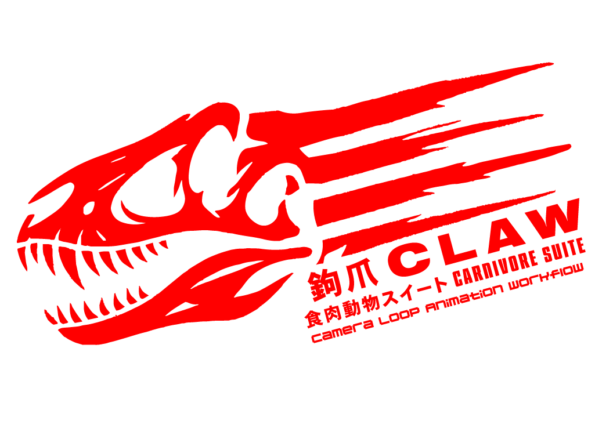

# 

# Carnivore CLAW

**Carnivore CLAW** is a pipeline for creating 2D assets and sprite sheets from 3D models. It takes animations from as many cameras/directions as you designate in your scene, renders an animation for each, organizes them into folders, and uses Montage to stitch them together into a sprite sheet. This tool is game-engine agnostic, perfect for generating 2.5D, multi-directional sprite-based characters.

---

